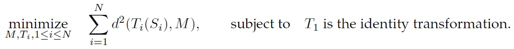
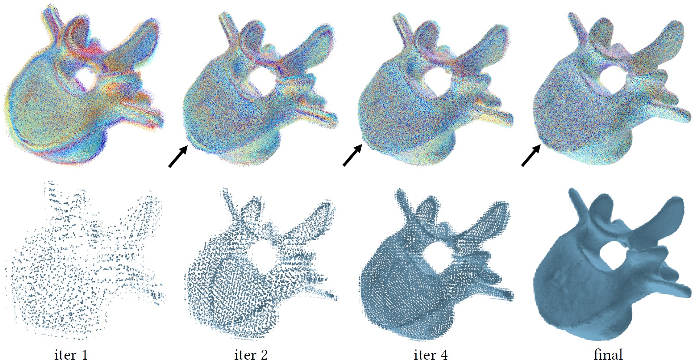
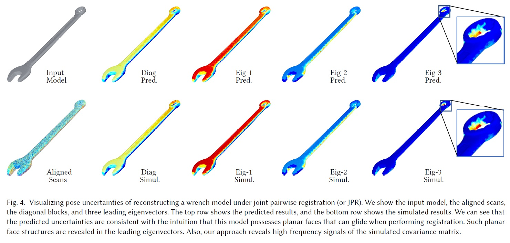

# Uncertainty Quantification for Multi-Scan Registration

This repository contains the reference implementation of our SIGGRAPH 2020 paper on "uncertainty quantification for multi-scan registration." We still actively update this code repository. Any feedback and comments are welcome.

To make this readme self-contained, we begin by reviewing the multi-scan registration problem. We then discuss two popular approaches for multi-scan registration, and this repository has implementations for both of them.  After that, we focus on the SIGGRAPH 2020 paper, which performs uncertainty quantification techniques for these approaches.  

# Multi-Scan Registration

Multi-scan registration seeks to align depth scans of the same object captured from different camera poses into the same coordinate system. This problem arises in geometry reconstruction of physical objects using a depth sensor. Specifically, the captured depth scans are stored in the local coordinate system associated with the depth sensor. In many cases, we do not know the relative transformations between these local coordinate system, e.g., when performing interactive scanning using a hand-hold camera. The goal of multi-scan registration is to align these scans in a world coordinate system. The insect figure illustrates the role of multi-scan registration in digitizing physical objects. 

Multi-scan registration techniques fall into the category of global methods where we do not place any assumption about the underlying ground-truth pose, and the category of local methods where we have some initial guess about the underlying ground-truth pose. This paper focuses on local methods, where uncertainty quantification will have transformative impacts. For more background on multi-scan registration, we refer to a <a href="https://users.cs.cf.ac.uk/Yukun.Lai/papers/R2NRR.pdf">survey paper</a>.

A multi-scan registration technique typically solves an optimization problem. There are two popular multi-scan registration methodologies. One is called joint pairwise registration; another is called simultaneous registration and reconstruction. In the following, we provide some technical details of both formulations. 

# Joint Pairwise Registration

Joint pairwise registration seeks to minimize the distances between pairs of overlapping scans by jointly transforming all the input scans. This formulation is an extension of pair registration. It also connects to bundle adjustment for multi-view registration. The difference is that for scan registration, the correspondences between scans are dynamically updated according to closest points. Formally speaking, joint pairwise registration amounts to solve the following optimization problem:

where $d$ measures the distance between a pair of overlapping scans, note that this distance typically requires to model partial similarities between scan pairs. This is typically done by using reweighted correspondences between points. Since the objective function consists of non-linear least squares, we solve joint pairwise registration using the Gauss-Newton method. The procedure alternates among the following three steps:
1) Compute nearest neighbors of sample points between each pair of scans to form initial correspondences.
2) Reweight the correspondences based on their distances.
3) Minimize the weighted sum of distances using the Gauss-Newton method. The figure below shows an example.

Our implementation of this approach is included in folder 'JPR'

>> load('Jsample_data.mat');

>> [poses_opt, NNStruct] = jpr_opt(scans, Para);

'scans' collects the input scans. Each scan is a collection of surfels, where each surfel contains its position, normal, and color (not used).

'poses_opt' contains the optimized scan poses. Each column is a 12 dimensional vector that includes [t; reshape(R,[9,1])];

'NNStruct' collects optimized correspondences between the aligned scans. 

# Simultaneous Registration and Reconstruction

The idea of simultaneous registration and reconstruction is totally different from that of joint pairwise registration. It aligns all the input scans to a latent surface. The latent surface is dynamically changing to fit the input scans. After alignment, the input scans are automatically aligned with respect to the latent surface. On ther other hand, the latent surface becomes the reconstruction. Formally speaking, we seek to solve following optimization problem.

In the <a href="https://www.cs.utexas.edu/~huangqx/icra10.pdf">ICRA10 paper</a>, we define latent surface $M$ as a collection of surfels attached to a grid representation. This formulation enables a very simple alternating minimization procedure:
1) Given the current scans, computing averages among points with each cell to obtain a surfel (e.g., plane fitting to a collection of points).
2) Given the optimized latent surface, perform pair-wise registration between each scan and the latent surface. Note that the correspondences in this procedure are given when constructing the latent surface. The figure below illustrates the procedure (bottom row shows the optimized latent surface):

Our implementation of this approach is included in folder 'SRAR'

>> load('sample_data.mat');

>> [poses_opt, LatentSurf] = srar_opt(scans, Para);

'scans' collects the input scans. Each scan is a collection of surfels, where each surfel contains its position, normal, and color (not used).

'poses_opt' contains the optimized scan poses. Each column is a 12 dimensional vector that includes [t; reshape(R,[9,1])];

'LatentSurf' collects the optimized latent surface and correspondences between the aligned scans and the latent surface. 

# Uncertainty Quantification 

One of the fundamental chanllenges of multi-scan registration is to assess the registration quality. Unlike global errors where the matches are completely off, global drifts are very hard to observe (since locally, the scans are aligned together). The registration error is typically caused by the noise in the input scans. This calls approaches to quantify the pose errors of the output based on noisy models for generating the input scans. In our recent SIGGRAPH 2020 paper, we introduced approaches that satisfy the following properties:

1) The input noise model can be directed estimated from the aligned scans.
2) We introduced a closed-form approximation of the output covariance matrix. The approximation only requires one set of aligned scans.

For joint pairwise registration, the procedure is the following:

>> load('sample_data.mat');

>> [poses_opt, LatentSurf] = srar_opt(scans, Para);

>> [CovM] = jpr_uq(scans, poses_opt, NNStruct);

>> % Step 3: Extract point-wise variance

>> for scanid = 1 : length(scans)

>>    VariancePred.pointwise_diag{scanid} = extract_pvar(scans{scanid},...

>>        CovM.Diag{scanid});

>>    VariancePred.pointwise_eigen{scanid} = extract_pvarII(scans{scanid},...

>>        CovM.eigenVecs((6*scanid-5):(6*scanid-3),Para.uq_focused_eigenId),...

>>        CovM.eigenVecs((6*scanid-2):(6*scanid),Para.uq_focused_eigenId));

>> end

For simultaneous registration and reconstruction, the procedure is the following:

>> load('sample_data.mat');

>> [poses_opt, LatentSurf] = srar_opt(scans, Para);

>> CovM = srar_uq(scans, poses_opt, LatentSurf, Para);

>> % Step 3: The rest is the same as above;

# Acknowlegement

Our implementation of joint pairwise registration utilized the <a href="https://www.cs.umd.edu/~mount/ANN/">ANN library</a>. 
