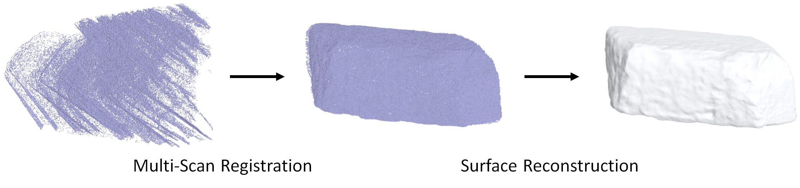
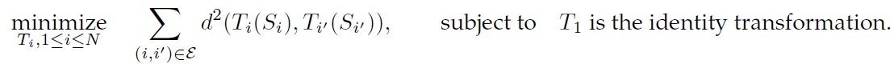
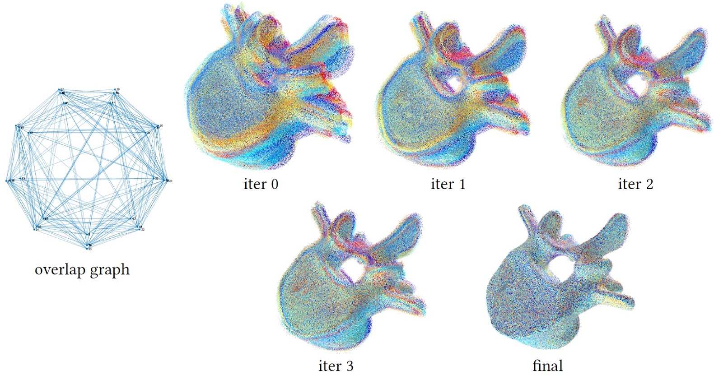

# Uncertainty Quantification for Multi-Scan Registration

This repository contains the reference implementation of our SIGGRAPH 2020 paper on "uncertainty quantification for multi-scan registration." We still actively update this code repository. Any feedback and comments are welcome.

To make this readme self-contained, we begin by reviewing the multi-scan registration problem. We then discuss two popular approaches for multi-scan registration, and this repository has implementations for both of them.  After that, we focus on the SIGGRAPH 2020 paper, which performs uncertainty quantification techniques for these approaches.  

# Multi-Scan Registration

Multi-scan registration seeks to align depth scans of the same object captured from different camera poses into the same coordinate system. This problem arises in geometry reconstruction of physical objects using a depth sensor. Specifically, the captured depth scans are stored in the local coordinate system associated with the depth sensor. In many cases, we do not know the relative transformations between these local coordinate system, e.g., when performing interactive scanning using a hand-hold camera. The goal of multi-scan registration is to align these scans in a world coordinate system. The insect figure illustrates the role of multi-scan registration in digitizing physical objects. 

Multi-scan registration techniques fall into the category of global methods where we do not place any assumption about the underlying ground-truth pose, and the category of local methods where we have some initial guess about the underlying ground-truth pose. This paper focuses on local methods, where uncertainty quantification will have transformative impacts. For more background on multi-scan registration, we refer to a <a href="https://users.cs.cf.ac.uk/Yukun.Lai/papers/R2NRR.pdf">survey paper</a>.

A multi-scan registration technique typically solves an optimization problem. There are two popular multi-scan registration methodologies. One is called joint pairwise registration; another is called simultaneous registration and reconstruction. In the following, we provide some technical details of both formulations. 

# Joint Pairwise Registration

Joint pairwise registration seeks to minimize the distances between pairs of overlapping scans by jointly transforming all the input scans. This formulation is an extension of pair registration. It also connects to bundle adjustment for multi-view registration. The difference is that for scan registration, the correspondences between scans are dynamically updated according to closest points. Formally speaking, joint pairwise registration amounts to solve the following optimization problem:

where $d$ measures the distance between a pair of overlapping scans. Note that this distance typicallys requires to model partial similarities between scan pairs. This is typically down by using reweighted correspondences between points. Since the objective function consists of non-linear least squares, we solve joint pairwise registration using the Gauss-Newton method. The procedure alternates among the following three steps:
1) Compute nearest neighbors of sample points between each pair of scans to form initial correspondences.
2) Reweight the correspondences based on their distances.
3) Minimize the weighted sum of distances using the Gauss-Newton method. The figure below shows an example.

Our implementation of this approach is included in folder 'JPR'

>> load('sample_data.mat');

>> [poses_opt, NNStruct] = jpr_opt(scans, Para);

'scans' collects the input scans. Each scan is a collection of surfels, where each surfel contains its position, normal, and color.

'poses_opt' contains the optimized scan poses. Each column is a 12 dimensional vector that includes [t; reshape(R,[9,1])];

'NNStruct' collects optimized correspondences between the aligned scans. 

# Simultaneous Registration and Reconstruction

# Uncertainty Quantification 

